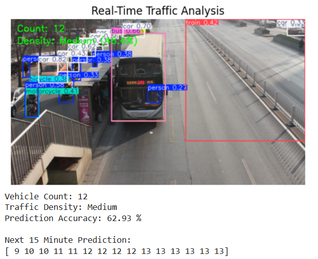

# Vision-Based Traffic Density Estimation and Prediction

## 📌 Description
This project uses YOLOv8 for vehicle detection and LSTM for traffic prediction.

## 🚀 Features
- Vehicle detection using YOLOv8
- Traffic density classification (Low/Medium/High)
- 15-minute future prediction using LSTM

## 🛠 Technologies Used
- Python
- YOLOv8 (Ultralytics)
- TensorFlow (LSTM)
- OpenCV

## 📊 Dataset
UA-DETRAC dataset

## ▶️ How to Run
1. Install requirements
2. Run the notebook/script

## 📈 Output
- Vehicle count
- Density classification
- Future predictions
- ## 📸 Output Screenshots

### Vehicle Detection

